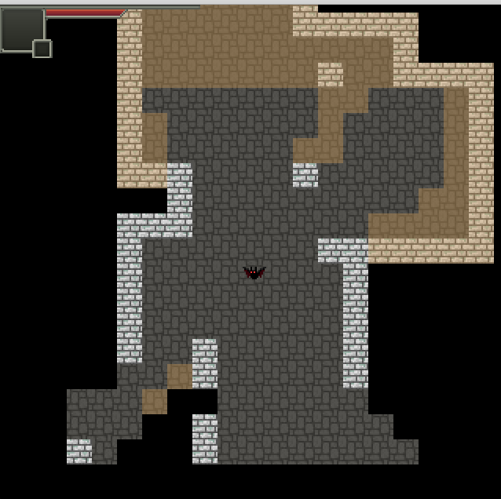
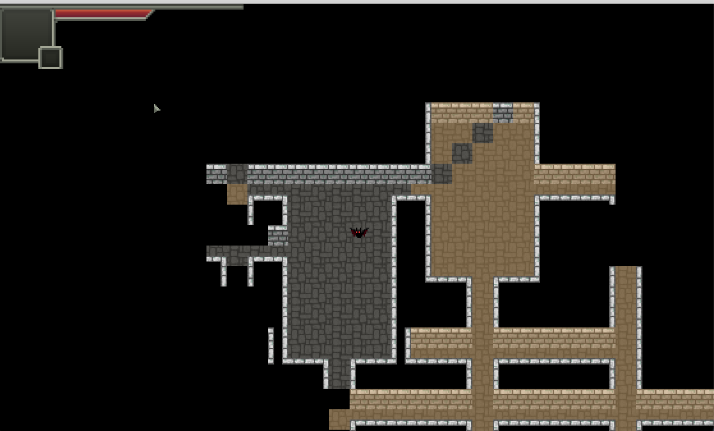

# py-shattered-pixel-dungeon

screenshot for version 0.1.0 :

screenshot for version 0.1.1 :

This is a shattered-pixel-dungeon demo (just begin) writen in python3 with pygame and love.

The code is based on 
[shattered-pixel-dungeon](https://github.com/00-Evan/shattered-pixel-dungeon.git) by 
[00-Evan](https://github.com/00-Evan) and 
[pixel-dungeon](https://github.com/watabou/pixel-dungeon.git) by 
[Watabou](https://github.com/watabou). I do not ues the code directly, but read and rewrite instead.
(when I have no idea, I use the source.)
I learned a lot. Besides, the fov algorithm used is based on an article 
[Symmetric ShadowCasting](https://www.albertford.com/shadowcasting/). Really a good article. 
This [tcod tutorial](https://rogueliketutorials.com/tutorials/tcod/v2) also teaches me a lot.

Note that __this repository does not accept pull requests!__ The code here is provided in hopes that 
others may find it useful for their own projects, not to allow community contribution. 
Issue reports of all kinds (bug reports, feature requests, etc.) are welcome.

## what has been done

- [x] a simple input handler. (refracted version)
- [x] a simple SpriteSheet loader.
- [x] a simple map generator.
- [x] basic fov.

## Todo

- [ ] refract the bad code. (working)
- [ ] UI. (working)
- [x] TimeSystem. (almost done!)
- [ ] ActionSystem. (working)
- [x] Tiles. (almost done!)
- [ ] AI extensions. (designing)
- [ ] Better Room class.
- [ ] Better and more flexible map generator.
- [ ] Better FOW.
- [ ] Mobs.
- [ ] NPCs.
- [ ] Request System.
- [ ] Magic System.
- [ ] SAN System.
- [ ] Inventory System.
- [ ] Music and Sound.
- [ ] Interface for Machine Learning.
- [ ] Stories.
- [ ] ...